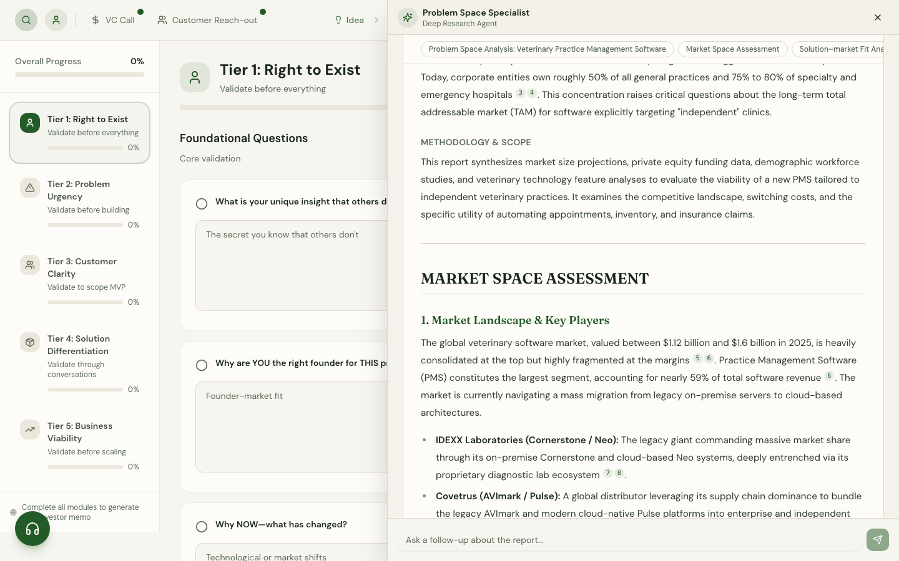
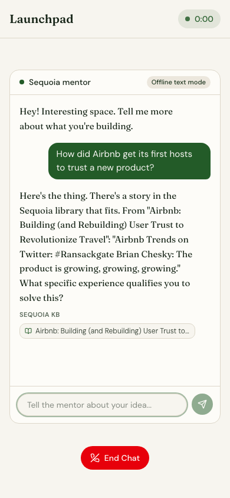
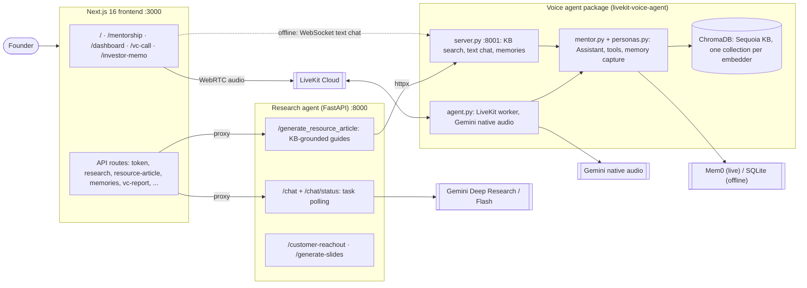
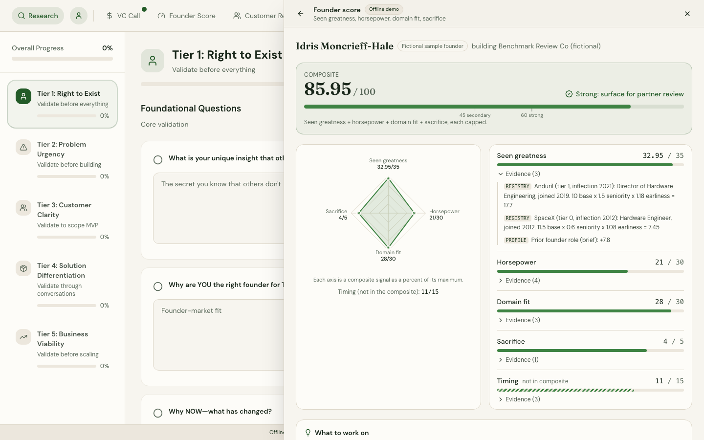

# Launchpad (VC Agent)

Launchpad won first place at Brown Hacks 2026. It helps prefounders work through a startup idea.

Launchpad uses Sequoia Capital's evaluation methodology to take an idea through a mentor
conversation, a 5-tier validation dashboard, market research, customer discovery, a simulated VC
pitch, and a printable investment memo. The aim is an investor-ready story.

The mentor and VC voice agents use LiveKit and Gemini native audio. They search a ChromaDB index
of Sequoia podcast transcripts and articles and use Mem0 for long-term memory. A FastAPI service
runs Gemini Deep Research for market research. The tests and CI use an offline mode that needs no
keys or network.

Demo walkthrough: **[Loom](https://www.loom.com/share/8702524fdef44b14936edce3c784a8de)**

| Research report (offline replay) | Mentor chat, offline text mode |
|---|---|
|  |  |

## What it does

- **Mentor call.** Talk to an AI Sequoia partner that grounds its advice in real founder stories
  (Airbnb, DoorDash, Nvidia, and 100+ *Crucible Moments* and *Training Data* transcripts). It
  searches the knowledge base on every turn and remembers what you told it in earlier calls.
- **Validation dashboard.** 5 tiers of 4 questions each, modeled on how investors pressure-test
  an early company. Each question has a resource drawer with curated Sequoia reading and an AI
  guide that cites the knowledge-base passages it used.
- **Deep market research.** The first turn runs Gemini's Deep Research agent (about 3 to 6
  minutes) and returns a sourced market assessment; follow-ups use Gemini Flash with Search.
- **Customer discovery.** Finds B2C communities (Reddit) or B2B leads (Apollo) for your ideal
  customer profile.
- **Memory-driven autofill.** What you say in calls is stored in long-term memory and mapped onto
  the dashboard fields.
- **VC pitch simulator.** Pitch a skeptical partner, then get a post-call report (diagnosis,
  strengths, gaps, unanswered "terrifying questions", next steps) that also fills in the
  dashboard.
- **Investment memo and pitch deck.** Everything compiles into a printable memo and a generated
  12-slide deck.

## The Sequoia validation framework

The dashboard is organized into five tiers, each with four questions
(`frontend/lib/dashboard-data.ts`):

| Tier | Module | Focus |
|-----:|--------|-------|
| 1 | Right to Exist (founder) | Unique insight, why you, why now, commitment |
| 2 | Problem Urgency (problem) | Hair-on-fire problem, current workarounds, cost of inaction |
| 3 | Customer Clarity (customer) | High-expectation customer, reachability, buyer vs. user |
| 4 | Solution Differentiation (product) | Eureka moment, different not just better, the wedge |
| 5 | Business Viability (market) | Willingness to pay, path to revenue, defensibility, plan to win |

## Architecture



- The **frontend** mints LiveKit tokens with `{startupIdea, agentMode}` in the metadata, proxies
  the research agent, and long-polls for the VC report.
- The **research agent** runs long jobs as tracked asyncio tasks. `/chat` returns a `task_id`
  right away, and `/chat/status/{id}` reports `queued`, `running` (with progress notes),
  `completed`, `failed` or `cancelled`. At most 16 jobs run at once (then 503), a job still
  running after two hours or at shutdown is cancelled, and a cancelled or timed-out live deep
  research run is also cancelled on Gemini's side. Finished tasks and idle chat histories are
  evicted after a TTL. All provider calls are async: `google-genai`'s `client.aio`, `httpx`
  for Apollo and Manus, and PRAW in the threadpool.
- The **voice-agent package** owns the knowledge base. The LiveKit worker and `server.py` both
  use the same `Assistant` class, persona prompts and tools (`search_knowledge_base`,
  `recall_memory`). `server.py` also serves `/kb/search`, which the research agent's guides use,
  and a text-chat WebSocket that runs the agent inside a real livekit-agents `AgentSession`.
- **Knowledge base.** 116 transcripts and 499 sequoiacap.com pages, chunked into
  9,025 chunks of 2,000 characters with 400 overlap. Each index build is a new Chroma collection
  tagged with its `embedder_id` (`provider/model/revision/dim/preprocessing-hash`). A pointer
  file is swapped atomically only after every chunk is embedded, and queries refuse a collection
  built by a different embedder, so OpenAI and MiniLM vectors never mix.

## Founder score

The dashboard's **Founder Score** panel scores the founder, not the idea. It uses one of four
fictional samples or a profile you enter. Its engine is ported from sierra-demo, a pipeline
Krish built with Akshay Irudayaraj to rank early-stage founders from SEC Form D filings. The
port lives in `research-agent/scoring/` as a plain Python package (no web framework, settings,
or clock).



Four signals add up to a raw 0-100 score. Each point traces to a line of evidence:

| Signal | Max | What it reads |
|---|---|---|
| Seen greatness | 35 | Roles at companies in a hand-built registry of 465 high-outcome companies, weighted by tier, seniority, and how early the founder joined; prior-founder and small-company-builder bonuses |
| Horsepower | 30 | Duration-weighted title level (a 6-level hierarchy with technical-role modifiers), degree and school, and the climb across the last three roles |
| Domain fit | 30 | Founder and company tagged in a 15-domain taxonomy and compared in seven tiers from a perfect subdomain match down to adjacent domains, with a keyword-overlap adjustment |
| Sacrifice | 5 | The seniority left behind to start the company |
| Timing | 15 | Raise recency and size, a founding title, a recent departure. Shown, not summed, as in sierra-demo |

Bands: 60 and up is "strong", 45-59 "secondary", below 45 "filter", sierra-demo's starting points.

Domain tags come from Gemini in live mode (sierra-demo's prompt and settings). Offline, the sample
founders replay Gemini tags recorded for their exact inputs
(`research-agent/scoring/recordings/classifications.json`, made by
`scripts/record_classifications.py`), and anything else goes through a keyword lexicon over the
same taxonomy. The scorecard says which source each tag came from.

Endpoints: `GET /founder/samples`, `GET /founder/samples/{id}/score`, `POST /founder/score`
(profile, optional company, `as_of`). Offline scores are computed as of a fixed date so they are
reproducible; live mode uses the founder's date.

Where the port deviates from sierra-demo, and why:

- Stock-ticker aliases in the registry ("team" for Atlassian, "open" for Opendoor) only match
  when written in capitals, and an alias can't take over another company's name.
- Schools must match the founder-school list or an explicit alias exactly; sierra-demo's
  substring and fuzzy match also credited Smith College ("mit"), Penn State and Northeastern.
- A raise dated after `as_of` isn't counted as fresh. The API goes further and refuses (422) a
  role or raise that starts after `as_of`, and a raise above $1T.
- With no raise date or amount, timing is 0, so the founding-title (+3) and recent-departure (+2)
  points are not given either. sierra-demo has the same guard (no filing, no timing), but it only
  scored founders it found through Form D filings, so its founders always had a raise and never
  reached it. The dashboard form has no raise fields, so a profile entered there always gets
  timing 0; only the API (`company.raise_date`, `raise_amount`) and the sample founders set it.
  Timing is not part of the composite.
- A current role with no end date counts up to `as_of` in the horsepower weighting instead of
  being dropped.
- Experience is sorted before scoring, since the scorers read the first entry as the founding
  role: roles without an end date come first (founder titles ahead of the rest), then past roles
  newest first.
- When the profile has no current title, timing reads the first role's title for its "founding
  title" signal.
- The `cd` keyword synonym had a stray backtick ("cont`inuous-deployment") in sierra-demo's data;
  the copy here fixes it. It's the only change to the copied data files.
- A failed or out-of-taxonomy Gemini classification falls back to the keyword lexicon and is
  labelled `fallback_error`, instead of becoming "other" silently.
- Company evidence comes from what the founder writes (a description of 8+ words is "medium"),
  not from Form D, website and PDL enrichment.

The registry lists 13 companies more than once, 4 of them with conflicting tiers (elastic,
plaid, marqeta, brex). As in sierra-demo, the later entry wins for any name or alias both
entries share. Timing's "left a job in the last six months" point reads the first role's end
date, which after sorting is the current role, so it almost never fires; sierra-demo behaves the
same way. The score reads a resume, not a person. It reflects what an investor skimming the
profile would notice first.

## Live mode and offline mode

`VC_AGENT_MODE` picks the providers at startup. Offline mode doesn't use provider keys and
makes no network calls. The Python services skip their `.env` files, and their key getters
(`config.key`, `settings.gemini_api_key`) return nothing even if a key is in the environment.
The Next routes check `isOffline()` before any provider call or token mint. The Reddit, Apollo
and Manus code reads its keys from the environment directly, but that code is only reached in
live mode. The `/_diag` canary reports whether a Gemini key is visible, which is its job.

| | Live (`VC_AGENT_MODE=live`, default) | Offline (`VC_AGENT_MODE=offline`) |
|---|---|---|
| Deep research | Gemini `deep-research-pro-preview-12-2025` | `FixtureResearchProvider`: replays one of 3 recorded real runs through the same task/status flow, with a banner saying whether it's the exact recorded prompt, the same idea with different context, or the nearest sample idea |
| Research follow-ups | `gemini-2.5-flash` + Google Search | the recorded follow-up if the question matches, else sentences quoted from the report |
| KB embeddings | OpenAI `text-embedding-3-small` collection (`KB_EMBEDDER=local` also works) | local `all-MiniLM-L6-v2` (ONNX, pinned by revision and sha256 in `models.lock`) |
| Resource guides | Gemini writing from the retrieved passages with `[n]` citations; Google Search only when the KB returns nothing | extractive: quoted, cited sentences from the retrieved passages |
| Memory | Mem0 cloud (`AsyncMemoryClient`) | `LocalMemoryStore`: SQLite with the same `add` / `get_all` / `search` calls, ranked by MiniLM similarity |
| Mentor / VC conversation | LiveKit voice, Gemini native audio | text chat panel over a WebSocket to `server.py`, same `Assistant` and tools inside an `AgentSession`, driven by a scripted LLM |
| Customer reach-out, pitch deck | Reddit / Apollo / Manus + Gemini | turned off, with a message saying so |

The frontend picks its widgets from `NEXT_PUBLIC_VC_AGENT_MODE`, which Next inlines at build
time, so offline builds go to `frontend/.next-offline`. Server routes also check
`VC_AGENT_MODE` at runtime and fail closed (`/api/token` returns 409 offline).

## Quickstart (offline, no keys)

Needs `uv` (0.9), Node 22 with npm, and `make`.

```bash
make setup           # network needed once: locked deps, Chromium, pinned MiniLM into .models/, offline build
make index-offline   # embed the knowledge base locally (about 4.5 minutes on an M1 Pro)
make demo            # http://127.0.0.1:3000
```

Try one of the three recorded sample ideas (listed in
`research-agent/scripts/record_research_fixtures.py`), for example *"Practice-management
software for independent veterinary clinics that automates appointment reminders, inventory
reordering, and pet-insurance claims."*

Tests:

```bash
make test lint       # pytest with sockets disabled (except localhost), ruff, eslint, tsc
make e2e-offline     # Playwright: journey + egress canaries (run inside a network sandbox)
```

The e2e needs a blocked network to test offline behavior. Its egress spec asks each backend
process (the Next.js server, research agent, and voice-agent server) to connect to external
hosts, then fails if any connection succeeds. In CI it runs in a
`--network none` container (`.github/workflows/ci.yml`, `ci/e2e.Dockerfile`). On macOS, wrap
the whole process tree with `sandbox-exec`, using a profile that denies `network-outbound`
except `localhost`. `make egress-companion` runs the same probes unsandboxed and expects them to
connect, which shows the check isn't vacuous. Results are in
[docs/verification.md](docs/verification.md).

## Live setup

```bash
cp .env.template .env.local      # fill in the keys (also read by the frontend from frontend/.env.local)
make setup
make index-live                  # OpenAI embeddings, about $0.11; or run with KB_EMBEDDER=local
zsh start.sh                     # frontend :3000, research agent :8000, KB server :8001, LiveKit worker
```

`start.sh` expects `uv` and `npm` on your `PATH` and runs uvicorn without `--reload`. Stop the
services before rebuilding an index; queries retry once after a swap, but a rebuild isn't
meant to happen under load.

### Environment variables

| Variable | Used by | Purpose |
|----------|---------|---------|
| `LIVEKIT_URL`, `LIVEKIT_API_KEY`, `LIVEKIT_API_SECRET` | frontend token route, voice agent | LiveKit Cloud |
| `GEMINI_API_KEY` | all three services | research, guides, voice, reports, extraction |
| `OPENAI_API_KEY` | voice agent | OpenAI embedding collection |
| `MEM0_API_KEY`, `MEM0_USER_ID` | voice agent, frontend | long-term memory (default user `sequoia-mentor-agent`) |
| `REDDIT_CLIENT_ID`, `REDDIT_CLIENT_SECRET`, `REDDIT_USER_AGENT` | research agent | B2C discovery (PRAW) |
| `APOLLO_API_KEY` | research agent | B2B discovery |
| `MANUS_API_KEY` | research agent | pitch deck (falls back to Gemini) |
| `VC_AGENT_MODE` | all | `live` (default) or `offline` |
| `NEXT_PUBLIC_VC_AGENT_MODE` | frontend build | `offline` swaps voice widgets for the text chat |
| `KB_EMBEDDER` | voice agent | `openai` (live default) or `local` |
| `KB_EMBED_THREADS` | voice agent | ONNX threads for the local MiniLM embedder: 2 by default, `make index-offline` uses 0 (all cores) |
| `RESEARCH_SERVICE_URL`, `AGENT_SERVICE_URL`, `KB_SERVICE_URL` | frontend, research agent | service URLs (defaults: 127.0.0.1:8000 / :8001) |
| `VC_AGENT_DIAGNOSTICS` | all | `1` exposes the `/_diag` egress and provider endpoints |
| `ALLOWED_HOSTS` | research agent, voice agent | Host headers the APIs answer (default `127.0.0.1,localhost`); anything else gets a 400 |

Missing Reddit, Apollo or Manus keys fall back to placeholder messages or Gemini samples, and a
missing `MEM0_API_KEY` turns memory off in live mode.

## Repository layout

```
├── Makefile, models.lock, start.sh, scripts/run-offline.sh
├── frontend/              Next.js 16 app (App Router, React 19, Tailwind 4, shadcn/ui)
│   ├── app/               pages and API routes
│   ├── components/        feature components (text-agent-chat, research-chat, resource-drawer, ...)
│   └── e2e/               Playwright offline journey, egress canaries, screenshots
├── research-agent/        FastAPI service
│   ├── main.py            routes and task lifecycle
│   ├── research_providers.py, fixture_research.py, guides.py, kb_client.py
│   ├── fixtures/research/ three recorded deep-research runs
│   └── scripts/record_research_fixtures.py
└── livekit-voice-agent/
    ├── agent.py           LiveKit worker
    ├── server.py          KB search, text chat WebSocket, memories
    ├── mentor.py, personas.py, scripted_llm.py, offline_report.py
    ├── rag.py, embeddings.py, ingest.py, model_store.py, memory.py
    └── data/              Sequoia transcripts and scraped articles
```

## API reference

Research agent (`:8000`):

| Method | Endpoint | Description |
|--------|----------|-------------|
| `POST` | `/chat` | Start a research turn (deep research first, fast follow-ups after). Returns `task_id`. |
| `GET` | `/chat/status/{task_id}` | `queued` / `running` / `completed` / `failed`, with progress notes and elapsed time. 404 after a restart, or an hour after the task finished. |
| `POST` | `/customer-reachout` | B2C communities or B2B leads for an ICP. Returns `task_id`. |
| `POST` | `/generate_resource_article` | KB-grounded guide with `citations`. |
| `POST` | `/resource_chat` | Follow-up about a guide, with citations. |
| `POST` | `/generate-slides` | 12-slide deck from dashboard modules. Returns `task_id`. |
| `GET` | `/health` | Health and mode. |

Voice-agent server (`:8001`): `POST /kb/search`, `WS /ws/chat?mode=mentor|vc&idea=...`,
`GET /memories`, `GET /health`.

Frontend routes (`:3000/api`): `token`, `research`, `customer-reachout`, `resource-article`,
`resource-chat`, `vc-report`, `memories`, `extract-fields`, and `diag/egress` (diagnostics only).

## Verification status

Details and result files: [docs/verification.md](docs/verification.md).

- **Verified offline, in CI's container setup and locally under a sandbox.** The journey from
  idea to research report, the KB-cited guide, and mentor chat with a recalled memory, with every
  backend process shown unable to reach the network.
- **Verified live once (2026-03-01).** Three Gemini deep-research runs, plus one through the
  running server with its `/health` latency measured. KB-grounded Gemini guides. A Mem0 cloud
  add/search round trip. A headless LiveKit voice session in which Gemini native audio heard a
  spoken question, called the KB tool, and answered aloud from the Airbnb transcript.
- **Not verified in CI.** Real LiveKit audio, Gemini native-audio behavior, Gemini deep-research
  quality, and Mem0 cloud. The offline text path shares the `Assistant`, tools, personas and
  memory capture with voice, but not the realtime native-audio turn loop.
- **Not verified at all.** The OpenAI-embedding collection (the available key has no credits),
  the browser microphone path, and Reddit/Apollo/Manus.

## Notes and limitations

- **Research reports aren't fact-checked.** Deep-research output is model-written analysis with
  inline source links. The links show which page a claim came from; the panel says so under
  every report, and nothing checks the claims against those pages.

- **In-memory state.** Research tasks and chat sessions live in the research agent's process
  memory, and `/api/vc-report` keeps the last report in a module variable. Finished tasks remain
  for an hour. After a restart, a poll returns 404 and the panel says the research was
  interrupted. A follow-up question then starts a fresh, paid deep-research run.
- **Live research progress.** Gemini's interactions API only returns the thought and search
  steps once a run finishes, so live mode shows elapsed time until then.
- **Offline answers are scripted.** The offline mentor quotes retrieved passages and asks the
  next question from the persona prompt; it doesn't reason. The offline VC report is assembled
  from the founder's own sentences.
- **Preview models.** `deep-research-pro-preview-12-2025` and
  `gemini-2.5-flash-native-audio-preview-12-2025` are preview IDs. `gemini-2.0-flash`, which
  the hackathon code used for reach-out, slides and reports, is already retired; those paths now
  use 2.5 models.
- **The scraped Sequoia data** (`livekit-voice-agent/data/sequoia_data.json`) includes some
  off-site pages; ingest skips navigation, people pages and duplicate URLs.

## Team

Built at Brown Hacks 2026 by:

- **Akshay Irudayaraj**: module-based dashboard UI, the Gemini deep-research agent and its
  citations, customer reach-out, VC call and investor memo, the single start script, docs.
- **Meghanadh Vasireddy**: the original RAG mentor agent, realtime voice integration and
  prompts, Gemini integration, memory-driven autofill for the VC flow.
- **Vedant Sangireddy**: the Sequoia resource drawer, tactical AI guides, and video resources.
- **Krish Maheshwari**: Mem0 persistent memory for the voice agent (priming, recall tool,
  storage), dashboard question updates. After the hackathon: the offline composition, async
  research agent, embedder-tagged knowledge base, local memory store, text transport, the founder
  score port, e2e tests, CI and these docs.

The founder-scoring engine comes from sierra-demo by Krish Maheshwari and Akshay Irudayaraj.

Some resource-drawer and research commits were made by Google's Jules coding agent and are
attributed to it in the history.

## License

The code is [MIT](LICENSE). The transcripts and the sequoiacap.com crawl in
`livekit-voice-agent/data/` are not: they are copyright Sequoia Capital and the speakers and
authors, and are included only for the demo and research use. See [DATA_NOTICE](DATA_NOTICE).
