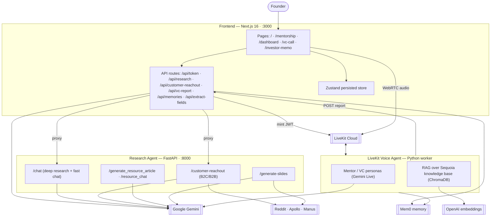

# 🚀 Launchpad

**A platform to help prefounders become founders.**

Launchpad is an AI‑guided startup‑validation studio built around Sequoia Capital's
evaluation methodology. It walks an aspiring founder from a raw idea to an
investor‑ready story through a voice mentorship call, a structured 5‑tier
validation dashboard, live market research, customer discovery, a simulated VC
pitch, and a printable investment memo — all powered by a fleet of AI agents.

> Built at Brown Hacks 2026.

---

## Table of contents

- [What it does](#what-it-does)
- [The Sequoia validation framework](#the-sequoia-validation-framework)
- [Architecture](#architecture)
- [The user journey](#the-user-journey)
- [Repository layout](#repository-layout)
- [The three services](#the-three-services)
  - [1. Frontend (Next.js)](#1-frontend-nextjs)
  - [2. Research Agent (FastAPI)](#2-research-agent-fastapi)
  - [3. LiveKit Voice Agent](#3-livekit-voice-agent)
- [Getting started](#getting-started)
- [Environment variables](#environment-variables)
- [API reference](#api-reference)
- [Tech stack](#tech-stack)
- [Notes & caveats](#notes--caveats)

---

## What it does

Launchpad turns the intimidating "how do I know if my idea is any good?" problem
into a guided, opinionated workflow. Instead of a blank pitch‑deck template, it
gives founders:

- 🎙️ **A voice mentor** — talk to an AI Sequoia partner that grounds its advice in
  real founder stories (Airbnb, Nvidia, Stripe‑era PayPal, DoorDash, and 100+
  "Crucible Moments" / "Training Data" podcast transcripts).
- 🧭 **A validation dashboard** — 5 tiers × 4 questions modeled on how top‑tier
  investors actually pressure‑test an early company.
- 🔬 **Deep market research** — an autonomous research agent that produces a
  sourced, investor‑grade market assessment and answers follow‑ups.
- 🎯 **Customer discovery** — automatically finds B2C communities (Reddit) or B2B
  leads (Apollo.io) matching your ideal customer profile.
- 🧠 **Memory‑driven auto‑fill** — insights spoken during voice calls are stored
  in long‑term memory and used to auto‑populate dashboard fields.
- 🦈 **A VC pitch simulator** — pitch a skeptical AI partner, then receive a blunt
  post‑call report (diagnosis, strengths, gaps, "terrifying questions", next steps).
- 📄 **An investment memo & pitch deck** — compile everything into a printable
  Sequoia‑style memo and a generated 12‑slide deck.

---

## The Sequoia validation framework

The dashboard is organized into five tiers, each with four probing questions
(defined in `frontend/lib/dashboard-data.ts`):

| Tier | Module | Focus |
|-----:|--------|-------|
| **1** | **Right to Exist** (founder) | Unique insight, why *you*, why *now*, commitment |
| **2** | **Problem Urgency** (problem) | Hair‑on‑fire problem, current workarounds, cost of inaction |
| **3** | **Customer Clarity** (customer) | High‑expectation customer, reachability, buyer vs. user |
| **4** | **Solution Differentiation** (product) | Eureka moment, different‑not‑just‑better, the wedge |
| **5** | **Business Viability** (market) | Willingness to pay, path to revenue, defensibility, plan to win |

Progress is tracked per‑module and globally, and the answers feed the research
agent, the investor memo, and the pitch deck generator.

---

## Architecture

Launchpad is a three‑service system: a Next.js frontend, a Python FastAPI
research backend, and a Python LiveKit voice agent. Multiple AI providers sit
behind them (Google Gemini, OpenAI embeddings, Mem0, plus Reddit / Apollo /
Manus data APIs).



---

## The user journey

1. **Idea (`/`)** — the founder types their startup idea. It's saved to the store
   and the dashboard is unlocked. *"Step 1 of 4: Clarify your idea."*
2. **Mentorship call (`/mentorship`)** — a real‑time voice conversation with an AI
   Sequoia mentor. Advice is grounded in the RAG knowledge base and insights are
   saved to long‑term memory.
3. **Dashboard (`/dashboard`)** — the hub. Answer the 5‑tier framework, and from
   here launch:
   - **Deep research** on your problem space,
   - **Customer reach‑out** (B2C communities or B2B leads),
   - **Sync Voice Chat** to auto‑fill fields from your call memories,
   - **AI resource guides** for any question,
   - the **VC pitch call**.
4. **VC pitch (`/vc-call`)** — pitch a skeptical AI partner. On "End Pitch" the
   agent generates a candid report that is displayed *and* used to auto‑fill
   dashboard fields.
5. **Investor memo (`/investor-memo`)** — everything compiles into a printable,
   confidential‑style investment memo. (A 12‑slide pitch deck can also be
   generated via the research backend.)

---

## Repository layout

```
brown-hacks/
├── start.sh                 # Boots all three services at once
├── .env.template            # All required API keys
├── package.json             # (root helper dep only)
│
├── frontend/                # Next.js 16 app (App Router, React 19)
│   ├── app/                 # Pages + API routes
│   ├── components/          # Feature + shadcn/ui components
│   └── lib/                 # Zustand store, dashboard schema, utils
│
├── research-agent/          # FastAPI backend (port 8000)
│   ├── main.py              # Endpoints: chat, customer-reachout, resources, slides
│   ├── slide_generator.py   # Sequoia-style pitch deck generation
│   └── test_endpoints.py    # pytest tests (mocked Gemini)
│
└── livekit-voice-agent/     # LiveKit voice agent (mentor + VC personas)
    ├── agent.py             # Agent logic, personas, memory, RAG tools
    ├── rag.py               # ChromaDB semantic search
    ├── ingest.py            # Builds the vector DB from data/
    └── data/                # 100+ Sequoia podcast transcripts + sequoia_data.json
```

---

## The three services

### 1. Frontend (Next.js)

A **Next.js 16** App Router app (React 19, TypeScript) styled with **Tailwind CSS v4**
and **shadcn/ui** ("new‑york" style, Sequoia‑inspired earthy‑green palette). Client
state lives in a persisted **Zustand** store (`launchpad-storage-v2`).

**Pages**

| Route | Purpose |
|-------|---------|
| `/` | Landing + idea input |
| `/mentorship` | AI mentor voice call (LiveKit, `mode=mentor`) |
| `/dashboard` | Main 5‑tier validation hub + feature launchers |
| `/vc-call` | VC pitch voice call (LiveKit, `mode=vc`) → generates report |
| `/investor-memo` | Printable compiled investment memo |

**API routes** (all secrets stay server‑side — see [API reference](#api-reference))
proxy to the research backend, mint LiveKit tokens, store/poll the VC report,
fetch Mem0 memories, and map memories onto dashboard fields via Jaccard
similarity with a Gemini fallback.

The voice UI uses `@livekit/components-react` (`LiveKitRoom`, `useVoiceAssistant`,
`BarVisualizer`) in audio‑only mode. The agent persona is selected by embedding
`{ startupIdea, agentMode }` into the LiveKit token metadata.

```bash
cd frontend
npm install
npm run dev        # http://localhost:3000  (Turbopack disabled: TURBOPACK=0)
```

### 2. Research Agent (FastAPI)

A **FastAPI** service (port **8000**) that orchestrates Google Gemini and
third‑party data APIs. All long‑running work runs as background tasks with a
task‑id + polling pattern; sessions and tasks are held in in‑memory dicts.

Capabilities:

- **Market research chat** (`/chat`) — the first turn runs a **Deep Research**
  agent (`deep-research-pro-preview-12-2025`) that produces a structured, sourced
  "Problem Space Assessment" as a Senior Market Researcher / early‑stage investor.
  Follow‑up turns use **`gemini-2.5-flash` with Google Search grounding** for fast
  answers.
- **Customer reach‑out** (`/customer-reachout`):
  - **B2C** → Gemini extracts keywords, **PRAW** searches relevant subreddits, and
    Gemini writes a tailored outreach strategy per community + offline venue ideas.
  - **B2B** → Gemini parses the ICP into **Apollo.io** search params, queries
    Apollo for people + organizations, and falls back to Gemini‑generated sample
    leads if Apollo returns nothing.
- **Resource guides** (`/generate_resource_article`, `/resource_chat`) — generate
  and chat about tactical, Sequoia‑partner‑style startup guides.
- **Pitch deck** (`/generate-slides`) — assembles a 12‑slide Sequoia‑style deck
  from the dashboard answers, filling gaps with Gemini, via the **Manus** API
  (`nano_banana_pro`, `.pptx`) with a structured‑JSON Gemini fallback
  (`gemini-2.0-flash`).

```bash
cd research-agent
python -m venv .venv && source .venv/bin/activate
pip install -r requirements.txt
uvicorn main:app --reload --port 8000
pytest                       # runs mocked endpoint tests
```

### 3. LiveKit Voice Agent

A **LiveKit Agents** worker that runs a real‑time, low‑latency voice conversation
using **Google Gemini Live** (`gemini-2.5-flash-native-audio-preview-12-2025`,
native audio in/out). It has two personas selected via room metadata:

- **Mentor** (voice: *Puck*) — a warm‑but‑sharp Sequoia partner who always grounds
  advice in a real story pulled from the knowledge base.
- **VC** (voice: *Kore*) — a skeptical partner running a high‑stakes pitch
  simulation, ending with a pass/fail verdict.

Under the hood it combines three tools/systems:

- **RAG** (`search_knowledge_base`) — semantic search over a **ChromaDB** vector
  store built from 100+ Sequoia podcast transcripts and scraped Sequoia articles,
  embedded with **OpenAI `text-embedding-3-small`**.
- **Long‑term memory** (`recall_memory`) — **Mem0** stores meaningful things the
  founder says across sessions and primes each new call with prior context.
- **Post‑call report** — when the VC page requests it (via a LiveKit data message),
  the agent summarizes the pitch into a structured report
  (`gemini-2.0-flash-lite-preview-02-05`) and POSTs it to the frontend's
  `/api/vc-report`.

```bash
cd livekit-voice-agent
uv sync
uv run ingest.py             # one-time: build the ChromaDB vector store from data/
uv run agent.py dev          # run as a LiveKit worker
# or:
uv run agent.py console      # talk to it directly in your terminal
```

---

## Getting started

### Prerequisites

- **Node.js** 18+ and **npm** (frontend)
- **Python 3.13+** and **[uv](https://docs.astral.sh/uv/)** (voice agent)
- **Python 3.10+** (research agent — `uvicorn`, `praw`, `google-genai`)
- A **LiveKit Cloud** project
- API keys: **Google Gemini**, **OpenAI**, **Mem0**, and (optional) **Reddit**,
  **Apollo.io**, **Manus**

### Quick start

```bash
git clone https://github.com/Brown-Hacks-2026/brown-hacks.git
cd brown-hacks

# 1. Configure secrets
cp .env.template .env         # fill in your keys
#    Also create frontend/.env.local and livekit-voice-agent/.env.local
#    (or a shared .env.local at the repo root — see notes below)

# 2. Install dependencies (once)
cd frontend && npm install && cd ..
cd research-agent && pip install -r requirements.txt && cd ..
cd livekit-voice-agent && uv sync && uv run ingest.py && cd ..

# 3. Boot everything
zsh start.sh
```

`start.sh` launches all three services and wires up graceful shutdown:

| Service | Where |
|---------|-------|
| Frontend | http://localhost:3000 |
| Research Agent | http://localhost:8000 |
| LiveKit Voice Agent | background worker (connects to LiveKit Cloud) |

> **Note:** `start.sh` is a `zsh` script and expects `uvicorn`, `uv`, and `npm` on
> your `PATH`. On first run, make sure you've built the ChromaDB store with
> `uv run ingest.py` inside `livekit-voice-agent/`.

---

## Environment variables

All keys live in `.env.template` at the repo root. Each service loads env files
defensively (checking its own directory, the CWD, and the repo root), so a single
root `.env` / `.env.local` generally works — but the frontend reads `.env.local`
and the Python services also look for `.env` / `.env.local`.

| Variable | Used by | Purpose |
|----------|---------|---------|
| `LIVEKIT_URL` | frontend token route, voice agent | LiveKit Cloud project URL (`wss://…`) |
| `LIVEKIT_API_KEY` | frontend token route, voice agent | LiveKit auth |
| `LIVEKIT_API_SECRET` | frontend token route, voice agent | LiveKit auth |
| `GEMINI_API_KEY` | all three services | Gemini deep research, chat, reports, extraction |
| `OPENAI_API_KEY` | voice agent (RAG) | Embeddings for ChromaDB (`text-embedding-3-small`) |
| `MEM0_API_KEY` | voice agent, frontend | Long‑term memory (Mem0) |
| `MEM0_USER_ID` | frontend | Mem0 user id (default `sequoia-mentor-agent`) |
| `REDDIT_CLIENT_ID` | research agent | B2C customer discovery (PRAW) |
| `REDDIT_CLIENT_SECRET` | research agent | B2C customer discovery (PRAW) |
| `REDDIT_USER_AGENT` | research agent | Optional; defaults to `BrownHacksResearchAgent/1.0` |
| `APOLLO_API_KEY` | research agent | B2B lead discovery (Apollo.io) |
| `MANUS_API_KEY` | research agent | Optional; pitch‑deck generation (falls back to Gemini) |
| `RESEARCH_SERVICE_URL` | frontend | Optional; research backend base URL (defaults to `http://127.0.0.1:8000`) |

Every integration **degrades gracefully**: missing Reddit/Apollo/Manus keys fall
back to Gemini‑generated samples or helpful placeholder messages, and a missing
`MEM0_API_KEY` simply disables memory.

---

## API reference

### Research Agent (`:8000`)

| Method | Endpoint | Description |
|--------|----------|-------------|
| `POST` | `/chat` | Start a research turn (deep research on turn 1, fast chat after). Returns `task_id`. |
| `GET` | `/chat/status/{task_id}` | Poll a chat/reach‑out/slide task for `processing`/`completed`/`failed`. |
| `POST` | `/customer-reachout` | Find B2C communities or B2B leads for an ICP. Returns `task_id`. |
| `POST` | `/generate_resource_article` | Generate a tactical startup guide (synchronous). |
| `POST` | `/resource_chat` | Chat about a generated guide (synchronous). |
| `POST` | `/generate-slides` | Generate a 12‑slide pitch deck from dashboard modules. Returns `task_id`. |
| `GET` | `/health` | Health check. |

### Frontend API routes (`:3000/api`)

| Method | Route | Description |
|--------|-------|-------------|
| `GET` | `/api/token` | Mints a LiveKit JWT with persona metadata (`room`, `mode`, `idea`). |
| `POST` / `GET` | `/api/research` | Proxies to the research agent's `/chat` + status. |
| `POST` / `GET` | `/api/customer-reachout` | Proxies to the research agent's reach‑out + status. |
| `POST` / `GET` | `/api/vc-report` | Stores the VC report (from the agent) / long‑polls for it. |
| `GET` | `/api/memories` | Fetches the founder's memories from Mem0. |
| `POST` | `/api/extract-fields` | Maps memory text onto the 20 dashboard fields (Jaccard + Gemini fallback). |

---

## Tech stack

**Frontend** — Next.js 16 (App Router) · React 19 · TypeScript · Tailwind CSS v4 ·
shadcn/ui + Radix · Zustand · LiveKit React components · react‑markdown · Recharts ·
Lucide.

**Research Agent** — FastAPI · Uvicorn · Google Gemini (`google-genai`) with Google
Search grounding · PRAW (Reddit) · Apollo.io · Manus (Nano Banana Pro) · pytest.

**Voice Agent** — LiveKit Agents · Google Gemini Live (native audio) · ChromaDB ·
OpenAI embeddings · LangChain text splitters · Mem0 · uv.

---

## Notes & caveats

This is a **hackathon build** — a few things are optimized for the demo rather than
production:

- **In‑memory state.** The research agent keeps chat sessions and tasks in Python
  dicts, and `/api/vc-report` stores the report in a module‑level variable. State
  resets on restart (use Redis/Postgres for production).
- **Hard‑coded local URLs.** The frontend proxy routes default to
  `http://127.0.0.1:8000`, and `resource-drawer.tsx` calls `http://localhost:8000`
  directly. Set `RESEARCH_SERVICE_URL` and parameterize the resource drawer before
  deploying.
- **Voice agent README is partly stale.** `livekit-voice-agent/README.md` describes
  an earlier OpenAI GPT‑4o + AssemblyAI + Cartesia pipeline; the current `agent.py`
  uses **Gemini Live** for real‑time audio (OpenAI is still used only for RAG
  embeddings). Follow the setup in *this* README.
- **Preview model IDs.** The code pins several preview Gemini models
  (`deep-research-pro-preview-12-2025`, `gemini-2.5-flash-native-audio-preview-12-2025`,
  etc.). Adjust these if they're unavailable on your API tier.
- **Minor copy typos** exist in some dashboard buttons (e.g. "Unocked").
